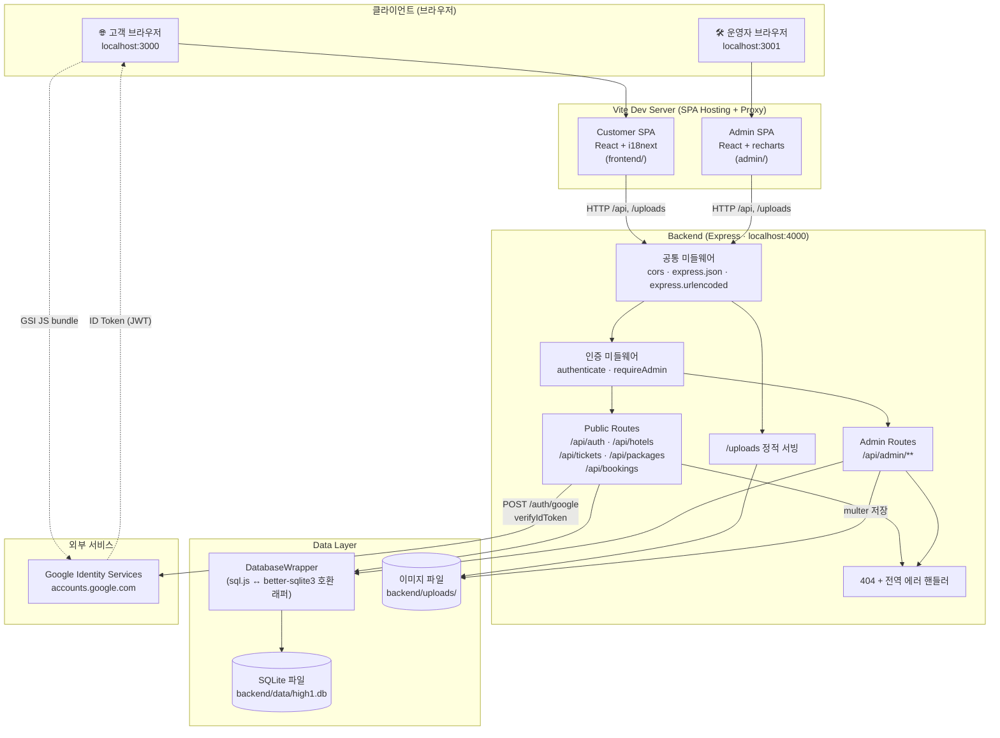
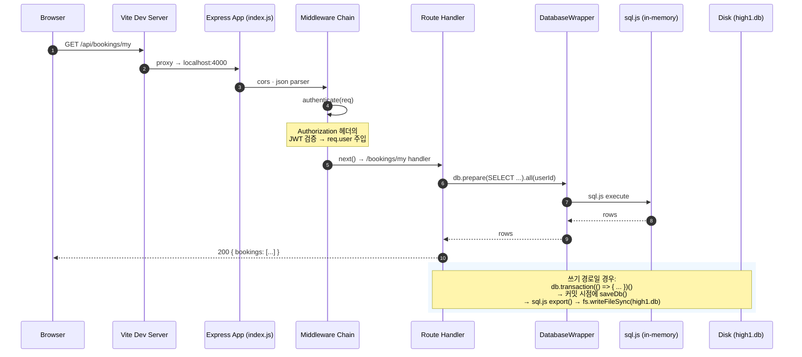
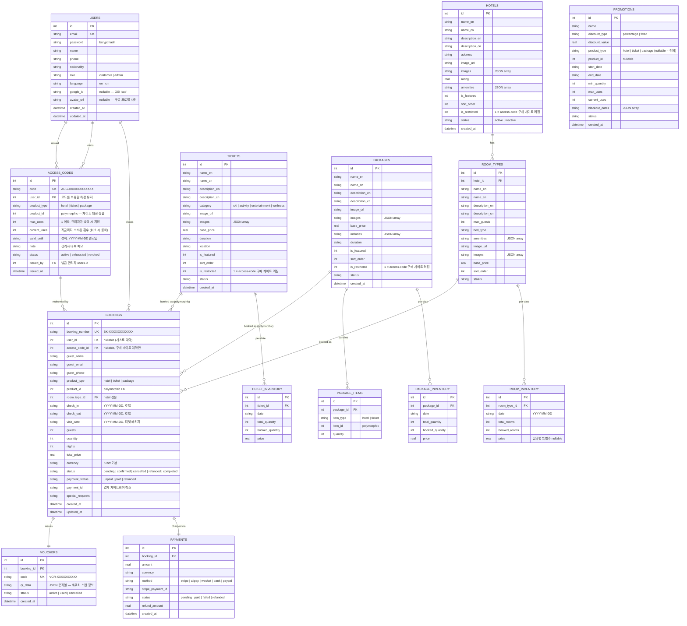
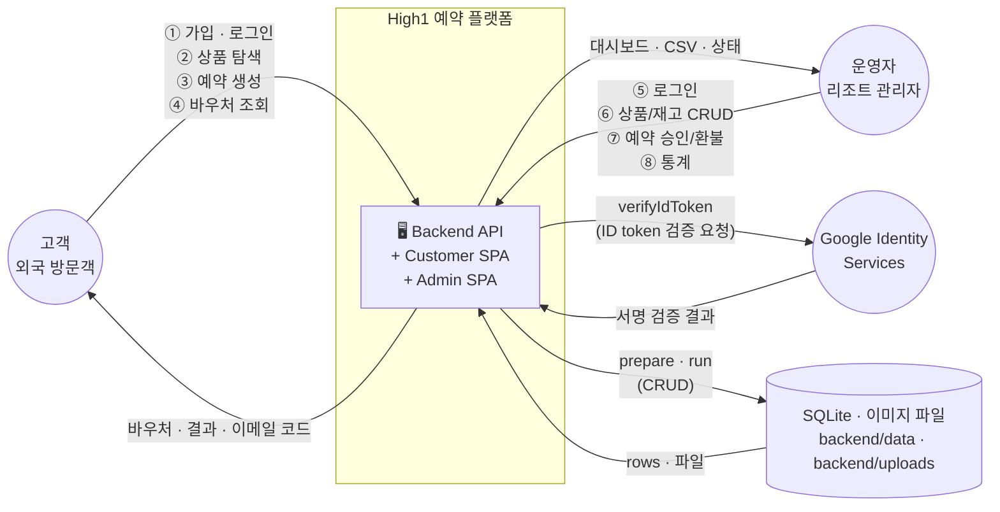
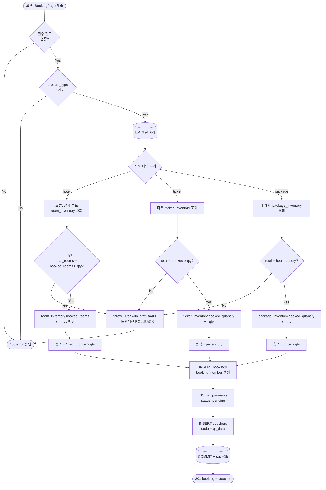
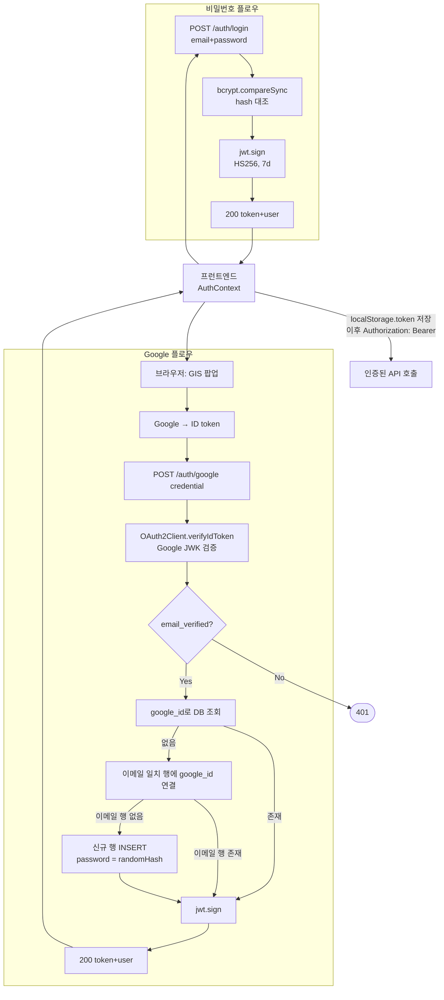

# amt-High1_Resort_HomePage

> **High1 Resort 외국인 전용 예약 플랫폼** — 3-앱 monorepo (backend API / admin panel / customer frontend)
>
> 본 문서는 시스템의 **아키텍처 · ERD · API 명세 · 기술 스택 · 코드 구조 · 보안/예외 처리 · DFD** 를 한 곳에 모은 설계 문서입니다.

---

## 목차

1. [개요](#1-개요)
2. [기술 스택](#2-기술-스택)
3. [시스템 아키텍처](#3-시스템-아키텍처)
4. [디렉터리 구조 및 모듈화](#4-디렉터리-구조-및-모듈화)
5. [ERD — 데이터 모델](#5-erd--데이터-모델)
6. [API 명세서](#6-api-명세서)
7. [데이터 흐름도 (DFD)](#7-데이터-흐름도-dfd)
8. [보안 및 예외 처리](#8-보안-및-예외-처리)
9. [실행 방법](#9-실행-방법)
10. [참고 문서](#10-참고-문서)

---

## 1. 개요

High1 Resort 외국인 전용 예약 플랫폼은 **한국 강원도 정선의 High1 리조트를 방문하는 외국 관광객**(주로 영어권 및 중화권)을 타깃으로 하는 **호텔/티켓/패키지 예약 웹 서비스**입니다. 내부적으로 세 개의 독립된 Node 앱으로 구성된 monorepo 이며, 개발 단계에서는 `start.sh` 한 줄로 세 프로세스를 동시에 기동합니다.

### 1.1 서비스 구성

| 앱 | 역할 | 접속 주소(개발) | 주 사용자 |
|---|---|---|---|
| **Backend API** | REST API · 비즈니스 로직 · SQLite 데이터 저장 · JWT 인증 · 파일 업로드 | `http://localhost:4000/api` | (내부 호출) |
| **Customer Frontend** | 고객용 예약 사이트. 호텔/티켓/패키지 검색, 예약, 바우처 조회, 프로필 관리 | `http://localhost:3000` | 외국인 고객 |
| **Admin Panel** | 운영자 콘솔. 상품/재고/예약/결제/프로모션/사용자 관리, 대시보드 통계 | `http://localhost:3001` | 리조트 운영자 |

### 1.2 핵심 도메인 개념

- **상품(Product)** 은 `hotel`, `ticket`, `package` 세 가지 타입. 예약 테이블은 `product_type` + `product_id` 의 폴리모픽 참조로 세 종류를 단일 스키마에서 처리합니다.
- **재고(Inventory)** 는 **날짜별 행(per-date row)** 으로 관리됩니다. 호텔은 `room_inventory`, 티켓은 `ticket_inventory`, 패키지는 `package_inventory` 테이블에 각각 (상품 ID × 날짜) 단위로 `total_*` 과 `booked_*` 카운터가 누적됩니다.
- **예약 생성** 시에는 가용성 확인 → `booked_*` 증가 → `bookings/payments/vouchers` INSERT 가 **하나의 SQLite 트랜잭션**으로 묶여 실행됩니다. 중간 실패 시 롤백되어 인벤토리 누수를 방지합니다.
- **바우처(Voucher)** 는 예약 1건당 1행 발급되며 QR 데이터와 UNIQUE 코드(`VCR-XXXXXXXXXX`)를 담습니다. 체크인 시 이 코드가 스캔/조회 대상입니다.
- **이중 언어(Bilingual)**: 상품 테이블의 `name_*` / `description_*` 은 `_en` / `_cn` 두 컬럼으로 병존합니다. 프런트엔드는 현재 i18n locale 에 따라 해당 컬럼을 고릅니다.
- **인증** 은 JWT(HS256, 7일 만료) 기반이며, 비밀번호 + Google Sign-In 두 가지 플로우가 하나의 `users` 테이블을 공유합니다(같은 이메일은 자동으로 연결).

### 1.3 설계 특성

- **외부 DB 서버 없음**: 데이터는 단일 SQLite 파일(`backend/data/high1.db`)로 관리되며, `sql.js` (WebAssembly) 를 통해 네이티브 바이너리 의존성 없이 순수 Node 에서 읽고 씁니다.
- **마이그레이션 시스템 없음**: 스키마 변경은 `config/database.js` 의 `CREATE TABLE` 블록과 idempotent `ALTER TABLE ... ADD COLUMN` 배열 두 곳에 함께 적어 신규/기존 환경 모두에 적용됩니다.
- **테스트 러너 없음**: 검증은 `node --check` (backend) · `vite build` (frontend/admin) · curl 기반 smoke test 에 의존합니다.
- **게스트 예약 허용**: 비로그인 상태에서도 예약 생성이 가능하며, 이후 재조회는 `booking_number` + `guest_email` 소유 증명으로 접근을 제어합니다.

---

## 2. 기술 스택

### 2.1 런타임 & 언어

| 구분 | 기술 | 용도 | 비고 |
|---|---|---|---|
| Runtime | **Node.js ≥ 18** | 모든 JS 실행 환경 | CommonJS(backend) + ESM(frontend/admin) 혼용 |
| Language | **JavaScript (ES2022)** / **JSX** | 전 영역 | TypeScript 미도입 |
| Package Manager | **npm** | 3개 앱 각자 독립 `package.json` | 루트 workspace 없음 |

### 2.2 Backend (`backend/`)

| 의존성 | 버전 | 역할 |
|---|---|---|
| `express` | ^4.21 | HTTP 서버 / 라우팅 / 미들웨어 파이프라인 |
| `sql.js` | ^1.14 | 순수 JS SQLite (WebAssembly). 네이티브 빌드 회피 |
| `bcryptjs` | ^2.4 | 비밀번호 해시 (cost 10) |
| `jsonwebtoken` | ^9.0 | JWT 발급/검증 (HS256, 7d 만료) |
| `google-auth-library` | ^10 | Google Sign-In ID token 검증 |
| `multer` | ^1.4-lts | multipart/form-data 이미지 업로드 |
| `cors` | ^2.8 | 개발환경 cross-origin 허용 |
| `uuid` | ^10 | 예약 번호 / 바우처 코드 생성 |

### 2.3 Customer Frontend (`frontend/`)

| 의존성 | 버전 | 역할 |
|---|---|---|
| `react` / `react-dom` | ^18.3 | UI 렌더러 |
| `vite` / `@vitejs/plugin-react` | ^5.4 / ^4.3 | dev 서버 + 번들러 |
| `react-router-dom` | ^6.28 | 클라이언트 라우팅 (lazy-loaded pages) |
| `i18next` / `react-i18next` | ^23 / ^15 | 국제화 (en/cn) |
| **Google Identity Services** | (CDN) | `accounts.google.com/gsi/client` 를 `index.html` 에서 직접 로드 |

### 2.4 Admin Panel (`admin/`)

| 의존성 | 버전 | 역할 |
|---|---|---|
| `react` / `react-dom` | ^18.3 | UI 렌더러 |
| `vite` / `@vitejs/plugin-react` | ^5.4 / ^4.3 | dev 서버 + 번들러 |
| `react-router-dom` | ^6.28 | 라우팅 (ProtectedRoute 로 인증 게이팅) |
| `recharts` | ^2.13 | 대시보드 시계열 차트 |

### 2.5 개발 / 배포 스크립트

| 스크립트 | 위치 | 하는 일 |
|---|---|---|
| `start.sh` | 루트 | 3개 앱 동시 기동 (+ 포트 4000/3000/3001 선점 해제, 첫 실행 시 seed) |
| `stop.sh` | 루트 | 세 포트에 바인딩된 프로세스 kill |
| `start-windows.bat` | 루트 | Windows 등가 스크립트 |
| `npm run seed` | `backend/` | 데모 데이터로 DB 전체 초기화 |
| `npm run dev` | `backend/` | `node --watch` 로 백엔드 핫 리로드 |
| `npm run dev` | `frontend/` & `admin/` | vite dev 서버 기동 |

### 2.6 도구 / 미도입 항목

- **TypeScript · ESLint · Prettier · Husky**: 현재 미설정.
- **테스트 러너 (Jest / Vitest / Playwright)**: 없음. 검증은 `node --check` + `vite build` + 수동 curl smoke test.
- **CI/CD**: 현재 구성 없음. GitHub 저장소만 존재.
- **외부 DB / Redis / 메시지 큐**: 없음. 모든 상태는 단일 SQLite 파일 + 디스크 업로드 디렉터리.

---

## 3. 시스템 아키텍처

### 3.1 레이어 구성 (Layered View)



### 3.2 요청 수명주기 (Request Lifecycle)

브라우저 요청이 서버에 도달해 응답이 돌아가는 과정:



### 3.3 런타임 프로세스 토폴로지

| 프로세스 | 포트 | 기동 명령 | 실행 주기 |
|---|---|---|---|
| `node src/index.js` (Express) | 4000 | `cd backend && npm start` | 단일 프로세스, 기동 시 `initDb()` 가 `high1.db` 를 메모리 로드 |
| `vite` (customer) | 3000 | `cd frontend && npm run dev` | 단일 프로세스, `/api` `/uploads` 를 backend 로 프록시 |
| `vite` (admin) | 3001 | `cd admin && npm run dev` | 단일 프로세스, 동일한 프록시 설정 |

> **한 가지 특수성**: sql.js 는 **메모리 내 DB** 이며 매 쓰기 후 `saveDb()` 가 전체 DB 를 `high1.db` 파일로 재직렬화합니다. 따라서 "하나의 Node 프로세스 = 한 번에 한 write-owner" 가 강제되고, 같은 DB 파일을 다른 프로세스가 동시 오픈하면 마지막 writer 가 이전 writer 의 변경을 덮어쓸 수 있습니다. 개발/단일 인스턴스 배포에 적합한 설계입니다.

---

## 4. 디렉터리 구조 및 모듈화

### 4.1 리포지터리 레이아웃

```
amt-automation/
├── README.md                 ← 이 문서 (아키텍처/ERD/API/DFD/보안)
├── CLAUDE.md                 ← AI 코딩 어시스턴트용 리포 가이드
├── GUIDE.md                  ← 한국어 end-user 실행 안내서
├── start.sh                  ← 3개 앱 한 번에 기동
├── stop.sh                   ← 3개 앱 kill
├── start-windows.bat         ← Windows 등가
│
├── backend/                  ← Express API (port 4000)
│   ├── package.json
│   └── src/
│       ├── index.js                 ← 부트스트랩 · 미들웨어 · 라우트 mount
│       ├── config/
│       │   └── database.js          ← sql.js 래퍼 + 스키마 + ALTER + transaction()
│       ├── middleware/
│       │   └── auth.js              ← authenticate · requireAdmin · JWT_SECRET
│       ├── routes/
│       │   ├── auth.js              ← /register · /login · /me · /google
│       │   ├── hotels.js            ← 호텔 조회/가용성
│       │   ├── tickets.js           ← 티켓 조회
│       │   ├── packages.js          ← 패키지 조회
│       │   ├── bookings.js          ← 예약 생성/조회/취소 (+ 인벤토리 복원 헬퍼)
│       │   └── admin/
│       │       ├── bookings.js      ← 관리자 예약 CRUD · 환불 · CSV export
│       │       ├── dashboard.js     ← /overview · 매출 시계열
│       │       ├── payments.js      ← 결제 통계 · 필터 · 상태 업데이트
│       │       ├── products.js      ← hotels/rooms/tickets/packages CRUD + /featured
│       │       ├── promotions.js    ← 프로모션 CRUD (+ blackout dates)
│       │       ├── upload.js        ← multer 기반 이미지 업로드
│       │       └── users.js         ← 사용자 목록/상세/권한 변경
│       └── seed.js                  ← 데모 데이터 시드
│
├── frontend/                 ← Customer SPA (port 3000)
│   ├── index.html                   ← Google Identity Services 스크립트 로드
│   ├── vite.config.js               ← /api, /uploads → :4000 프록시
│   └── src/
│       ├── main.jsx                 ← BrowserRouter + AuthProvider + i18n
│       ├── App.jsx                  ← 라우트 + lazy-load + Header/Footer 셸
│       ├── i18n/
│       │   ├── index.js             ← i18next 초기화
│       │   ├── en.json              ← 영어 리소스
│       │   └── cn.json              ← 중국어(간체) 리소스
│       ├── context/
│       │   └── AuthContext.jsx      ← login · register · logout · updateProfile · loginWithGoogle
│       ├── utils/
│       │   └── api.js               ← fetch 래퍼 (get/post/put/del)
│       ├── components/
│       │   ├── Header.jsx           ← 언어 토글 · 로그인 상태 · 내비
│       │   ├── Footer.jsx
│       │   ├── SearchBar.jsx        ← 홈 히어로 검색
│       │   ├── ProductCard.jsx      ← 호텔/티켓/패키지 리스트 카드
│       │   ├── DateRangePicker.jsx  ← 호텔 체크인/아웃 선택기
│       │   ├── SingleDatePicker.jsx ← 티켓/패키지 일자 선택기
│       │   └── GoogleSignInButton.jsx ← GIS 버튼 래퍼
│       └── pages/
│           ├── Home.jsx
│           ├── HotelList.jsx · HotelDetail.jsx
│           ├── TicketList.jsx · TicketDetail.jsx
│           ├── PackageList.jsx · PackageDetail.jsx
│           ├── BookingPage.jsx         ← 예약 폼 · snake_case 페이로드 · 총액 계산
│           ├── BookingConfirmation.jsx ← 예약 완료 (guest_email 쿼리 포워딩)
│           ├── BookingDetail.jsx       ← 내 예약 상세 + 취소
│           ├── MyBookings.jsx          ← 내 예약 리스트
│           ├── OrderLookup.jsx         ← 비회원 주문 조회
│           ├── Login.jsx · Register.jsx · Profile.jsx
│
├── admin/                    ← Admin SPA (port 3001)
│   ├── index.html
│   ├── vite.config.js               ← 동일한 /api, /uploads 프록시
│   └── src/
│       ├── main.jsx · App.jsx       ← ProtectedRoute 로 로그인 게이팅
│       ├── context/AuthContext.jsx  ← admin_token 으로 분리 저장
│       ├── utils/api.js             ← 401 시 자동 / 로 리다이렉트
│       ├── components/
│       │   ├── Sidebar.jsx · DataTable.jsx · Modal.jsx
│       │   ├── Pagination.jsx · StatsCard.jsx · StatusBadge.jsx
│       │   ├── ImageUploader.jsx        ← multipart/form-data 직접 호출
│       │   ├── RichTextEditor.jsx
│       │   ├── BulkInventoryManager.jsx ← 날짜 구간 일괄 재고 생성
│       │   └── PromotionManager.jsx     ← 상품 안 임베드 프로모션 CRUD
│       └── pages/
│           ├── Login.jsx
│           ├── Dashboard.jsx            ← recharts 시계열
│           ├── BookingManagement.jsx · BookingDetail.jsx
│           ├── ProductManagement.jsx
│           ├── HotelManagement.jsx      ← 호텔 + 객실 타입 + 재고
│           ├── TicketManagement.jsx · PackageManagement.jsx
│           ├── UserManagement.jsx · UserDetail.jsx
│           ├── PaymentManagement.jsx    ← 결제 리스트/필터/상세
│           └── Settings.jsx
│
├── backend/data/             ← (gitignore) SQLite 파일 런타임 저장소
│   └── high1.db
└── backend/uploads/          ← (gitignore) multer 가 저장한 이미지
```

### 4.2 모듈화 원칙

| 원칙 | 적용 방식 |
|---|---|
| **3-앱 분리** | backend/admin/frontend 는 완전히 독립된 `package.json`. 공유 코드는 현재 없음(필요 시 공용 `packages/` 도입 가능). |
| **라우트 = 파일 1개** | `backend/src/routes/<resource>.js` 하나가 해당 리소스의 전체 엔드포인트를 담당. `routes/admin/` 은 관리자 전용 네임스페이스. |
| **인증 일괄 적용** | 관리자 라우터는 각 파일 상단에서 `router.use(authenticate, requireAdmin)` 로 전체 엔드포인트에 인증을 한 번에 건다. |
| **재사용 헬퍼 export** | `routes/bookings.js` 의 `restoreBookingInventory` 는 `module.exports` 속성으로 노출되어 `admin/bookings.js` 가 동일 로직(날짜 루프 + `MAX(0, booked_* - qty)`) 을 재사용. |
| **페이지 lazy-load** | 고객 프런트의 모든 페이지 컴포넌트는 `React.lazy` + `Suspense` 로 코드 스플리팅. admin 은 일반 import (관리자 UX 우선). |
| **스타일 인라인 객체** | CSS-in-JS 라이브러리 미사용. 페이지/컴포넌트 상단의 `const styles = { ... }` 객체로 관리. |
| **i18n 키 집중** | 모든 고객 노출 문자열은 `frontend/src/i18n/{en,cn}.json` 두 파일에만 존재. 하드코딩 금지. admin 은 영어 전용이라 i18n 미적용. |
| **snake_case 계약** | backend REST 응답 · 요청은 전부 snake_case (`product_type`, `check_in`, `booking_number` …). 프런트의 camelCase 로컬 state 는 경계에서만 매핑. |

---

## 5. ERD — 데이터 모델

모든 테이블은 `backend/src/config/database.js` 의 `initTables()` 함수 안 한 블록의 `CREATE TABLE IF NOT EXISTS` 로 선언되고, 이후 컬럼 추가는 같은 함수 아래의 idempotent `ALTER TABLE ... ADD COLUMN` 배열에서 일괄 처리됩니다.

### 5.1 엔티티 관계도 (Mermaid)



### 5.2 주요 제약 / 특수 설계

| 테이블 | 설계 메모 |
|---|---|
| `users` | 이메일 UNIQUE. 소셜 로그인 사용자도 `password` NOT NULL 제약을 만족시키기 위해 **예측 불가능한 랜덤 bcrypt 해시** 를 저장합니다(아무 비밀번호로도 로그인 불가). `google_id` 의 존재가 "소셜 계정" 플래그 역할. |
| `bookings` | `user_id` 는 nullable — **게스트 예약** 지원. `product_type` + `product_id` 는 hotels/tickets/packages 세 테이블을 가리키는 폴리모픽 FK (SQLite 수준의 실제 FK 는 걸려 있지 않음). 호텔 예약은 `check_in`/`check_out`, 티켓/패키지는 `visit_date` 만 채웁니다. |
| `*_inventory` | `(상품_id, date)` UNIQUE. **매 날짜마다 1행**. `booked_*` 카운터는 예약 생성 시 증가, 취소/환불 시 `MAX(0, booked_* - qty)` 로 감소(double-decrement 방지). |
| `payments` | 1 예약 당 1 결제 행으로 관리(부분 결제 미지원). 환불은 `status='refunded'` + `refund_amount` 갱신. |
| `vouchers` | 1 예약 당 1 바우처. `code` 는 UNIQUE. 취소/환불 시 `status='cancelled'` 로 비활성화. |
| `promotions` | `blackout_dates` 는 JSON 배열 문자열. 실제 할인 적용 로직은 현재 예약 생성 경로에서 참조되지 않음(향후 확장 대상). |
| `access_codes` | **구매 게이트** 토큰 저장. `code` UNIQUE (`ACG-XXXXXXXXXXXX`). `(user_id, product_type, product_id)` 인덱스. `current_uses` 는 예약 생성 트랜잭션에서 `+1`, 취소/환불 트랜잭션에서 `MAX(0, n-1)` 로 롤백되며, `max_uses` 에 도달하면 `status='exhausted'` 로 자동 전이. 관리자가 `DELETE /admin/access-codes/:id` 하면 `status='revoked'` 로 soft delete (이력은 남는다). `hotels/tickets/packages.is_restricted=1` 과 짝이 되어야 게이트가 실제로 발동. |
| `hotels/tickets/packages.is_restricted` | 0 기본. 1 이면 해당 상품을 예약할 때 유효한 `access_code` 가 POST body 에 실려 있어야 하고 로그인 필수. 목록/상세 페이지에서는 🔒 "Invite only" 배지로 노출되지만 상품 자체는 숨지 않는다(정책: "배지 달고 노출 + 예약만 차단"). |
| `bookings.access_code_id` | nullable. 코드로 만들어진 예약 row 에만 채워지며, 취소 시 이 id 로 `access_codes.current_uses` 를 되돌리는 역추적 경로 역할을 한다. 별도 `access_code_redemptions` 감사 테이블이 필요 없는 설계 근거. |
| JSON-in-TEXT 컬럼 | `amenities`, `images`, `includes`, `blackout_dates` 는 SQLite TEXT 에 JSON 문자열로 저장. 라우트 핸들러가 응답 직전에 `JSON.parse` 로 펼쳐 반환. |

### 5.3 스키마 진화 규칙

- **신규 컬럼 추가**는 반드시 두 곳에 동시 적용:
  1. `initTables()` 의 `CREATE TABLE` 본문 (신규 설치 시)
  2. 같은 함수 아래 `alterStatements` 배열 (기존 DB 업그레이드 시)
- 각 `ALTER` 는 `try { db.exec(sql); } catch (e) { /* 이미 존재 */ }` 로 감싸져 **idempotent** 합니다. 서버를 여러 번 재기동해도 에러 없이 통과합니다.
- 컬럼 **삭제 / 이름 변경 / NOT NULL 제약 완화**는 SQLite 한계로 테이블 재작성 (`CREATE TABLE new → INSERT SELECT → DROP → RENAME`) 이 필요하며, 마이그레이션 시스템이 없으므로 현재는 수동으로 처리해야 합니다.

---

## 6. API 명세서

### 공통 규약

- **Base URL (dev)**: `http://localhost:4000/api`
- **요청/응답 바디**: JSON (`Content-Type: application/json`). 파일 업로드만 `multipart/form-data`.
- **필드 네이밍**: 요청 바디 · 쿼리 · 응답 전부 `snake_case`.
- **인증**: `Authorization: Bearer <JWT>` 헤더. JWT 는 `/api/auth/login`, `/api/auth/register`, `/api/auth/google` 에서 발급되며 HS256 · 7일 만료.
- **에러 응답 shape**: `{ "error": "<message>" }` 로 통일. HTTP status 로 분류.
- **공통 에러 코드**:
  - `400` 필수 필드 누락 / 값 검증 실패 / 날짜 범위 오류
  - `401` 인증 실패 / 토큰 만료 / 사용자 없음
  - `403` 인증됐으나 권한 부족 (admin 이 아님 / 예약 소유자가 아님)
  - `404` 리소스 없음
  - `409` 충돌 (예: 이미 등록된 이메일)
  - `500` 내부 에러 (console 에만 스택 남김)
  - `503` 기능 비활성화 (예: `GOOGLE_CLIENT_ID` 미설정)

---

### 6.1 인증 · 사용자 `/api/auth`

| Method | Path | Auth | Body / Query | 응답 (주요) |
|---|---|---|---|---|
| `POST` | `/register` | — | `{ name, email, password, phone?, nationality?, language? }` | `201 { message, token, user }` · `400` 검증 실패 · `409` 이미 등록 |
| `POST` | `/login` | — | `{ email, password }` | `200 { message, token, user }` · `401` 자격 실패 |
| `POST` | `/google` | — | `{ credential }` (Google ID token) | `200 { message, token, user }` · `400` credential 누락 · `401` 검증 실패/미검증 이메일 · `503` `GOOGLE_CLIENT_ID` 미설정 |
| `GET` | `/me` | 필요 | — | `200 { user }` · `401` |
| `PUT` | `/me` | 필요 | `{ name?, phone?, nationality?, language? }` | `200 { message, user }` · `400` 업데이트할 필드 없음 |

> **Google Sign-In 동작 규칙**: 같은 이메일의 기존 비밀번호 계정이 있으면 **동일 행에 `google_id` 를 붙여 연결**합니다. 새 계정일 때는 password 컬럼에 `crypto.randomBytes(32)` 기반 bcrypt 해시를 저장해 비밀번호 로그인이 원천 불가하도록 만듭니다.

---

### 6.2 호텔 `/api/hotels`

| Method | Path | Auth | Query | 응답 |
|---|---|---|---|---|
| `GET` | `/` | — | `search?` | `200 { hotels: [...] }` (amenities JSON 파싱, `is_featured DESC, sort_order ASC, rating DESC` 정렬) |
| `GET` | `/:id` | — | — | `200 { hotel, room_types }` · `404` 없음 |
| `GET` | `/:id/availability` | — | `check_in`, `check_out` (YYYY-MM-DD, 필수) | `200 { hotel, check_in, check_out, availability: [ { room_type, dates: [...], min_available, total_price, nights, is_available } ] }` · `400` 날짜 누락 · `404` |

### 6.3 티켓 `/api/tickets`

| Method | Path | Auth | Query | 응답 |
|---|---|---|---|---|
| `GET` | `/` | — | `category?`, `search?` | `200 { tickets: [...] }` |
| `GET` | `/:id` | — | — | `200 { ticket }` · `404` |
| `GET` | `/:id/availability` | — | `date` (YYYY-MM-DD) | `200 { ticket, date, available, price }` · `400` / `404` |

### 6.4 패키지 `/api/packages`

| Method | Path | Auth | Query | 응답 |
|---|---|---|---|---|
| `GET` | `/` | — | `search?` | `200 { packages: [...] }` (includes JSON 파싱) |
| `GET` | `/:id` | — | — | `200 { package, items }` (items 는 PACKAGE_ITEMS 행 + 상품 요약) · `404` |
| `GET` | `/:id/availability` | — | `date` (YYYY-MM-DD) | `200 { package, date, available, price }` · `400` / `404` |

---

### 6.5 예약 `/api/bookings`

| Method | Path | Auth | Body / Query | 응답 |
|---|---|---|---|---|
| `POST` | `/` | 선택 (게스트 허용, **restricted 상품은 필수**) | `{ guest_name, guest_email, guest_phone?, product_type, product_id, room_type_id?, check_in?, check_out?, visit_date?, guests?, quantity?, special_requests?, access_code? }` | `201 { message, booking, voucher }` · `400` 검증/가용성 실패 · `401` restricted 상품인데 미인증 · `403` access_code 누락/무효/만료/exhausted/revoked/유저 불일치/상품 불일치 · `404` 상품 없음 · `500` |
| `GET` | `/lookup` | — | `booking_number?`, `email?`, `phone?` | `200 { bookings: [{ ...booking, voucher }] }` · `400` 검색 키 부족 |
| `GET` | `/my` | **필요** | — | `200 { bookings: [...] }` (로그인 사용자 본인 예약만) |
| `GET` | `/:id` | 부분 | `guest_email?` (게스트 소유 증명) | `200 { booking, voucher, payment, product, room_type }` · `403` 소유권 실패 · `404` |
| `PUT` | `/:id/cancel` | 부분 | body: `{ guest_email? }` | `200 { message, booking }` · `400` 이미 취소 · `403` 소유권 실패 · `404` |

#### 예약 생성 트랜잭션 순서 (`POST /`)

1. 필수 필드 / product_type enum 검증 → 실패 시 `400`
2. `tryGetUserId(req)` 로 로그인 사용자면 `user_id` 확정, 아니면 `NULL`
3. `db.transaction(() => { ... })()` 시작
4. **구매 게이트 체크** (`readProductRestriction` + `validateAndConsumeAccessCode`):
   - 상품 테이블에서 `is_restricted` 플래그 조회 → 존재하지 않는 상품은 `404` throw
   - `is_restricted=1` 인 경우 body 의 `access_code` 를 검증:
     - 미인증이면 `401` throw
     - 코드 row lookup 후 `revoked` / `exhausted` / 유저 불일치 / 상품 불일치 / 만료 → `403` throw
     - 통과 시 원자적으로 `current_uses += 1`, 필요시 `status='exhausted'` 로 전이, `access_codes.id` 를 `accessCodeId` 로 기억
   - `is_restricted=0` 이면 `access_code` 가 와도 silent ignore
5. product_type 별 분기:
   - **hotel**: 날짜 루프 돌며 각 야간의 `room_inventory` 조회/검증 → `booked_rooms` 증가 + 단가 누적
   - **ticket / package**: 해당 날짜의 `*_inventory` 한 건 조회/검증 → `booked_quantity` 증가
6. `bookings` INSERT (`access_code_id` 컬럼 포함) → id 획득
7. `payments` INSERT (`status='pending'`)
8. `vouchers` INSERT (`code`, `qr_data` JSON)
9. COMMIT → `saveDb()` 가 `high1.db` 재직렬화
10. `201 { booking, voucher }` 응답

> 중간 어느 단계든 에러를 throw 하면 트랜잭션 전체가 ROLLBACK 되어 인벤토리 변경이 되돌려집니다. 에러에 `.status` 필드를 붙이면 호출부에서 해당 HTTP 코드로 번역됩니다.

#### 소유권 검증 (`GET /:id` / `PUT /:id/cancel`)

셋 중 하나만 충족되면 통과:

1. 인증된 사용자의 `id` 가 `booking.user_id` 와 일치
2. 인증된 사용자의 `role === 'admin'`
3. 요청 body/query 의 `guest_email` 이 DB 의 `guest_email` 과 대소문자 무시 일치

`1` · `2` 는 로그인 플로우, `3` 은 게스트 예약의 "예약 번호 + 이메일" 재조회 UX 를 지원합니다.

---

### 6.6 관리자 API `/api/admin/**`

모든 관리자 엔드포인트는 각 라우터 상단에서 `router.use(authenticate, requireAdmin)` 로 **`role='admin'` 만 통과** 시킵니다. 401/403 은 공통 규약을 따릅니다.

#### 6.6.1 대시보드 `/api/admin/dashboard`

| Method | Path | 응답 |
|---|---|---|
| `GET` | `/overview` | `200 { total_bookings, total_revenue, total_users, total_hotels, total_tickets, total_packages, pending_bookings, confirmed_bookings, cancelled_bookings, today_bookings, today_revenue }` |
| `GET` | `/revenue` | `200 { timeseries: [{ date, revenue, count }] }` (최근 30일 일별 매출) |

#### 6.6.2 예약 관리 `/api/admin/bookings`

| Method | Path | Body / Query | 응답 · 동작 |
|---|---|---|---|
| `GET` | `/stats` | — | `200 { total_bookings, total_revenue, today_bookings, status_breakdown, payment_breakdown, product_breakdown }` |
| `GET` | `/export` | `status?`, `payment_status?`, `product_type?`, `from_date?`, `to_date?` | `200 text/csv` (Content-Disposition attachment) |
| `GET` | `/` | 위와 동일 + `search?`, `page?`, `limit?` | `200 { bookings, pagination }` |
| `GET` | `/:id` | — | `200 { booking, voucher, payment, product, room_type, user }` (관리자는 소유권 체크 없음) |
| `PUT` | `/:id/status` | `{ status }` ∈ `pending\|confirmed\|cancelled\|refunded\|completed` | `cancelled`/`refunded` 로 전이 시 **`restoreBookingInventory` 실행 + 바우처 `cancelled`** — 모두 transaction. 이미 released 상태면 double-decrement 방지 위해 복원 skip. `400` 허용 외 status |
| `PUT` | `/:id/payment` | `{ payment_status, payment_id? }` | `bookings` + `payments` 두 테이블 동시 업데이트 (transaction). `payment_status='paid'` + 원래 `pending` 이면 `bookings.status='confirmed'` 로 자동 승격 |
| `POST` | `/:id/refund` | `{ refund_amount? }` | 이미 released 상태가 아니면 `restoreBookingInventory`, `payments` 환불 기록, `bookings` `refunded`, 바우처 `cancelled` — 전부 transaction. `400` 금액 오류 |

#### 6.6.3 상품 관리 `/api/admin/products`

상품 타입별로 CRUD 엔드포인트가 있습니다. 세 리소스 모두 동일한 구조(`GET /`, `GET /:id`, `POST /`, `PUT /:id`, `DELETE /:id`).

| 리소스 | Path prefix | 비고 |
|---|---|---|
| 호텔 | `/api/admin/products/hotels` | + 서브리소스: `/api/admin/products/hotels/:hotelId/rooms` (객실 타입 CRUD) |
| 티켓 | `/api/admin/products/tickets` | `is_featured`, `sort_order` 지원 |
| 패키지 | `/api/admin/products/packages` | + `/api/admin/products/packages/:packageId/items` (번들 아이템) |
| 재고 | `/api/admin/products/inventory` | 상품별 날짜 구간 일괄 생성 · 업데이트 |
| 추천 토글 | `PUT /api/admin/products/featured` | `{ product_type, product_id, is_featured?, sort_order? }` — `product_type` 은 `PRODUCT_TABLES` **allow-list** (`hotel`/`ticket`/`package`) 밖이면 `400` |

> **SQL 인젝션 방지**: `/featured` 엔드포인트는 과거에 알 수 없는 `product_type` 이 조용히 `packages` 테이블로 빠지는 버그가 있었습니다. 현재는 `PRODUCT_TABLES` 맵의 키가 아니면 즉시 `400` 으로 거절되고, 테이블 이름은 맵에서만 가져오므로 동적 SQL 에 사용자 입력이 절대 들어가지 않습니다.

#### 6.6.4 사용자 관리 `/api/admin/users`

| Method | Path | 동작 |
|---|---|---|
| `GET` | `/` | 페이지네이션 + 역할/검색 필터 |
| `GET` | `/:id` | 사용자 정보 + 예약 히스토리 |
| `PUT` | `/:id` | 이름/연락처/권한(`role`) 업데이트 |
| `DELETE` | `/:id` | 사용자 삭제 (예약의 `user_id` 는 FK ON DELETE SET NULL 로 NULL 이 됨) |

#### 6.6.5 결제 관리 `/api/admin/payments`

| Method | Path | Query / Body | 응답 |
|---|---|---|---|
| `GET` | `/stats` | — | `200 { total_payments, total_amount, total_refunds, pending_payments, status_breakdown, method_breakdown, today }` |
| `GET` | `/` | `status?`, `method?`, `from_date?`, `to_date?`, `page?`, `limit?` | `200 { payments, pagination }` (bookings 와 LEFT JOIN 된 결과) |
| `GET` | `/:id` | — | `200 { payment }` (+ 연결된 예약 요약 필드) |
| `PUT` | `/:id/status` | `{ status, stripe_payment_id? }` | 결제 + 예약 `payment_status` 동시 갱신, `paid` 면 예약 `confirmed` 로 승격 |

> 과거 admin PaymentManagement 페이지가 `start_date`/`end_date` 파라미터명을 보내 날짜 필터가 조용히 무시되던 버그가 있었습니다. 현재는 프런트·백엔드 모두 `from_date`/`to_date` 로 통일됐습니다.

#### 6.6.6 프로모션 `/api/admin/promotions`

| Method | Path | 동작 |
|---|---|---|
| `GET` | `/` | 전체 프로모션 + `blackout_dates` JSON 파싱 |
| `GET` | `/:id` | 단건 |
| `POST` | `/` | 생성 |
| `PUT` | `/:id` | 수정 |
| `DELETE` | `/:id` | 삭제 |

#### 6.6.7 이미지 업로드 `/api/admin/upload`

| Method | Path | Body | 응답 |
|---|---|---|---|
| `POST` | `/` | `multipart/form-data` · field `image` | `200 { url: "/uploads/<filename>", filename, size }` |
| `POST` | `/multiple` | `multipart/form-data` · field `images` (최대 10개) | `200 { files: [...] }` |

- multer 디스크 스토리지. 파일명은 `<timestamp>-<random>.<ext>`.
- **제한**: 단일 파일 10MB, MIME 화이트리스트 `jpeg | jpg | png | gif | webp`.
- 저장 경로: `backend/uploads/` (git ignore), 정적 서빙은 `GET /uploads/<filename>`.

#### 6.6.8 구매 게이트 코드 `/api/admin/access-codes`

관리자가 "특정 유저 × 특정 상품" 에 대한 예약 권한을 발급/관리하는 엔드포인트. 고객은 이 코드를 외부 채널(이메일·채팅)로 받아 `POST /api/bookings` 의 `access_code` 필드에 실어 보낸다. 자세한 트랜잭션 흐름은 §7.3.

| Method | Path | Body / Query | 응답 · 동작 |
|---|---|---|---|
| `GET` | `/` | `user_id?`, `product_type?`, `product_id?`, `status?`, `search?`, `page?`, `limit?` | `200 { access_codes: [{ ...row, user_email, user_name }], pagination }`. `product_type` 필터는 `['hotel','ticket','package']` allow-list. |
| `POST` | `/` | `{ user_id, product_type, product_id, max_uses?, valid_until?, note? }` | `201 { message, access_code, product_is_restricted }`. 코드 문자열은 서버가 `ACG-XXXXXXXXXXXX` 포맷으로 생성. `max_uses` 기본 1. 대상 유저/상품 부재 시 `404`. `product_is_restricted` 가 `false` 로 돌아오면 관리자가 아직 상품을 restricted 로 전환하지 않았다는 힌트 (코드 효력 없음 — UI 가 경고 배너 노출). |
| `GET` | `/:id` | — | `200 { access_code: { ... + user_email, user_name, issued_by_email }, redemptions: [{ booking_id, booking_number, status, created_at, check_in, check_out, visit_date, total_price, quantity }] }`. redemptions 는 `bookings.access_code_id` 로 역조회 — cancelled 포함. |
| `PUT` | `/:id` | `{ note?, max_uses?, valid_until?, status? }` | `200 { message, access_code }`. 수정 가능: 메모·최대사용수·만료일·status. `status` 는 `['active','revoked']` allow-list (`'exhausted'` 는 derived 상태라 admin 이 직접 못 씀). `max_uses < current_uses` 는 `400`. 수정 불가: `code`, `user_id`, `product_type`, `product_id`, `current_uses`, `issued_by`, `issued_at`. |
| `DELETE` | `/:id` | — | `200 { message, access_code }`. Soft revoke — `status='revoked'`. row 는 남긴다(감사/이력). 멱등 — 재호출해도 200. |

##### 코드 소비 / 롤백 수명주기

- **소비** (`POST /api/bookings`): `validateAndConsumeAccessCode` 가 트랜잭션 안에서 `current_uses += 1`, 한도 도달 시 `status='exhausted'`. 원자적 `UPDATE` 한 문장.
- **롤백** (`PUT /api/bookings/:id/cancel`, `PUT /api/admin/bookings/:id/status → cancelled|refunded`, `POST /api/admin/bookings/:id/refund`): `restoreAccessCodeUsage` 가 `current_uses = MAX(0, n-1)` 로 감소. `'exhausted' → 'active'` 로 전이. `'revoked'` 는 admin manual override 우선 원칙에 따라 건드리지 않는다.
- **double-rollback 방지**: admin 경로는 `wasReleased` 플래그(기존 status 가 이미 cancelled/refunded 인지)를 체크해 재취소 시 두 번 감소하지 않는다.

---

## 7. 데이터 흐름도 (DFD)

### 7.1 Level 0 — 시스템 경계



### 7.2 Level 1 — 예약 생성 플로우 (가장 복잡한 핵심 경로)



### 7.3 Level 1 — 취소 / 환불 시 재고 복원 플로우

```mermaid
flowchart LR
    subgraph Trigger["트리거"]
        direction TB
        C1[고객: PUT /bookings/:id/cancel]
        C2[관리자: PUT /admin/bookings/:id/status<br/>status=cancelled|refunded]
        C3[관리자: POST /admin/bookings/:id/refund]
    end

    Auth{권한 검증}
    Own{소유자/admin?}
    TxStart[(transaction BEGIN)]
    Released{이미 released?<br/>cancelled/refunded}
    Restore[restoreBookingInventory<br/>각 day/qty 만큼<br/>booked_* −= MAX 0 qty]
    Vou[UPDATE vouchers<br/>SET status = cancelled]
    Bk[UPDATE bookings<br/>SET status = cancelled/refunded]
    Pay[UPDATE payments<br/>refund_amount/status]
    TxEnd[(COMMIT + saveDb)]
    OK([200 booking])

    C1 --> Auth --> Own
    C2 --> Auth
    C3 --> Auth
    Own -- No --> Rej([403])
    Own -- Yes --> TxStart --> Released
    Released -- Yes --> Bk
    Released -- No --> Restore --> Vou --> Bk
    Bk --> Pay --> TxEnd --> OK
```

> **왜 이 가드가 중요한가**: 과거 admin `PUT /:id/status` 가 인벤토리를 복원하지 않아 관리자가 취소할 때마다 해당 날짜의 방/티켓이 영구적으로 "팔린 상태" 로 남는 버그가 있었습니다. 현재는 상태 전이가 `cancelled`/`refunded` 로 진입할 때 반드시 `restoreBookingInventory` 가 호출되고, 이미 released 상태에서 재호출돼도 `MAX(0, booked_* - qty)` 로 카운터가 음수가 되지 않도록 보호됩니다.

### 7.4 Level 1 — 인증 플로우 (Password + Google)



### 7.5 데이터 저장소 (Data Store 목록)

| 스토어 | 물리 형태 | 읽기/쓰기 위치 |
|---|---|---|
| `high1.db` | 단일 SQLite 파일 (sql.js export → `fs.writeFileSync`) | 모든 라우트 핸들러 · seed.js |
| `uploads/<file>` | 디스크 상 바이너리 이미지 | `routes/admin/upload.js` (multer write) · `/uploads` 정적 서빙 (read) |
| `localStorage['token']` | 브라우저 스토리지 | 고객 `frontend/src/utils/api.js` (read/write) |
| `localStorage['admin_token']` | 브라우저 스토리지 | 관리자 `admin/src/utils/api.js` (read/write) |
| `localStorage['language']` | 브라우저 스토리지 | `i18n/index.js`, Header/Profile 언어 토글 |

---

## 8. 보안 및 예외 처리

### 8.1 위협 모델과 대응

| 위협 | 영향 | 대응 | 위치 |
|---|---|---|---|
| 비밀번호 평문 노출 | 사용자 자격 유출 | **bcrypt (cost 10)** 해시 저장, `password` 컬럼은 `/auth/me` 응답에서 명시적으로 제외 | `routes/auth.js`, `middleware/auth.js` |
| JWT 위변조 | 임의 사용자 위장 | **HS256 + `JWT_SECRET`** 환경변수. 개발 fallback 이 있으나 운영 배포 시 반드시 주입 | `middleware/auth.js:34` |
| 만료된 토큰 재사용 | 세션 하이재킹 | `jwt.verify` 가 `TokenExpiredError` 던지면 전용 메시지로 401 | `middleware/auth.js:89` |
| 삭제된 사용자의 유효 토큰 | 고스트 로그인 | 토큰 검증 직후 `SELECT ... WHERE id = ?` 로 실제 사용자 row 재조회, 없으면 401 | `middleware/auth.js:73` |
| 예약 ID 순차 열거 | 타인 예약 PII 유출 | `GET /bookings/:id` 는 **소유자/어드민/matching guest_email 중 하나** 필수 | `routes/bookings.js` (`isAuthorizedForBooking`) |
| 비인증 예약 취소 | 사용자 악의적 취소 공격 | `PUT /bookings/:id/cancel` 도 동일한 소유권 검증 | 같은 파일 |
| 관리자 엔드포인트 노출 | 어드민 권한 탈취 | 모든 `/admin/*` 라우터가 상단에서 `router.use(authenticate, requireAdmin)` | `routes/admin/*.js` |
| SQL 인젝션 (파라미터) | DB 오염 | `db.prepare(...).run(...)` 의 **prepared statement + 바인딩** 을 모든 쿼리에 적용. `${...}` 로 값 보간 금지 | 전 라우트 |
| SQL 인젝션 (테이블명) | 우회 경로 | `/featured` 같이 테이블 이름을 동적으로 고르는 엔드포인트는 `PRODUCT_TABLES` **allow-list 맵**의 키만 허용하고 값은 맵에서 꺼내 쓴다 | `routes/admin/products.js` |
| 인벤토리 레이스 / 부분 실패 | 유령 예약 · 재고 과다 점유 | 예약 생성 · 취소 · 상태 변경을 **단일 `db.transaction()`** 으로 감싸고, 실패 시 ROLLBACK | `routes/bookings.js`, `routes/admin/bookings.js` |
| 중복 취소로 카운터 음수 | 재고 카운터 무결성 훼손 | 모든 복원 UPDATE 가 `booked_* = MAX(0, booked_* - qty)` | `restoreBookingInventory` |
| 상태값 오염 | 대시보드/필터 침묵 실패 | `PUT /admin/bookings/:id/status` 는 **`ALLOWED_BOOKING_STATUSES` allow-list** 로만 허용 | `routes/admin/bookings.js` |
| 파일 업로드 우회 | 임의 파일 저장 / XSS 벡터 | multer `fileFilter` 로 **MIME + 확장자 화이트리스트** (`jpeg/jpg/png/gif/webp`), 10MB limit, 파일명은 `timestamp-random.ext` 로 재생성 | `routes/admin/upload.js` |
| 업로드 디렉터리 path traversal | 경로 탈출 | 파일명 생성이 서버 측 무작위 suffix, 사용자 입력은 확장자만 검사 | 같은 파일 |
| Google ID token 스푸핑 | 가짜 Google 로그인 | `google-auth-library` 의 `verifyIdToken({ idToken, audience })` 가 Google JWKs 로 서명 · audience · 만료 검증. 실패 시 401 | `routes/auth.js` `/google` |
| 미검증 이메일 계정 | 이메일 하이재킹 | `payload.email_verified === false` 이면 즉시 401 로 거절 | 같은 파일 |
| 소셜 계정에 비밀번호 로그인 시도 | 혼동 로그인 | 신규 Google 사용자 생성 시 password 에 `crypto.randomBytes(32)` 의 bcrypt 해시를 저장 → 어떤 비밀번호로도 매칭 불가 | 같은 파일 (`randomPasswordHash`) |
| GOOGLE_CLIENT_ID 미설정 | 운영상 오류 | `/auth/google` 이 `503 "Google Sign-In is not configured"` 로 명확히 반환. 일반 비밀번호 플로우는 정상 동작 유지 | 같은 파일 |
| 과도한 페이로드 DoS | 메모리 폭증 | `express.json({ limit: '10mb' })` + multer file size 10MB 제한 | `index.js` + upload 라우트 |
| CORS 오·설정 | cross-origin 탈취 | 개발 환경은 vite proxy 로 처리, 백엔드는 `app.use(cors())` 기본값. **운영 배포 시 whitelisting 필요** | `index.js` |

### 8.2 전역 예외 처리 전략

#### Backend

- 모든 라우트 핸들러는 `try { ... } catch (err) { console.error(...); res.status(500).json({ error: 'Internal server error.' }); }` 패턴을 따릅니다. → 스택은 **서버 로그에만**, 클라이언트에는 일반 메시지만.
- 트랜잭션 안에서 throw 된 Error 에 `.status` 숫자 필드를 붙이면 상위 catch 에서 해당 HTTP 코드로 translate 합니다 (e.g. `400`, `404`). 그 외 에러는 500 으로 떨어집니다.
- 라우트 뒤에 붙는 **전역 에러 핸들러**(`(err, req, res, next) => {...}`) 가 비동기 throw 까지 캐치하는 최종 safety net 입니다.
- **404 핸들러**는 모든 라우트 뒤에 위치. `{ error: "Route <METHOD> <PATH> not found." }` 로 응답.

#### Frontend / Admin

- `utils/api.js` 의 fetch wrapper 가 non-2xx 응답에서 `Error` 를 throw 하되, `error.status` 와 `error.data` 속성에 응답 원문을 실어 보냅니다. 호출하는 페이지는 `try/catch` 로 받아 UI 배너에 `error.message` 를 출력합니다.
- Admin 패널의 api wrapper 는 `401` 응답을 가로채 `admin_token` / `admin_user` 를 로컬 스토리지에서 삭제하고 `/` 로 강제 리다이렉트합니다. 세션 만료 시 사용자가 혼란스러운 상태에 머물지 않도록.
- React 페이지는 `loading` · `error` · `success` 세 상태를 명시적으로 관리하며, 비동기 작업 전후에 각 플래그를 set 합니다.
- Google Sign-In 버튼은 자체적으로 `ready` / `missing-config` / `error` 상태를 갖고 있어, 부모 페이지는 GIS 스크립트 로드 실패까지 일일이 처리할 필요가 없습니다.

### 8.3 알려진 한계 / 운영 전 체크리스트

- [ ] **`JWT_SECRET` 환경변수 설정** (개발 fallback 을 운영에 쓰면 토큰 위조 가능)
- [ ] **`GOOGLE_CLIENT_ID` / `VITE_GOOGLE_CLIENT_ID` 설정** (Google Sign-In 필요 시)
- [ ] **CORS origin whitelist 축소** (현재 `cors()` 기본 = 모두 허용)
- [ ] **HTTPS 종단 설정** (리버스 프록시 또는 Node 직접)
- [ ] **sql.js → better-sqlite3 마이그레이션 검토** (고동시성/대용량 시 saveDb 비용 과도)
- [ ] **로그 수집** (현재는 `console.error` / `console.log` 만)
- [ ] **레이트 리미팅 / 봇 방어** (현재 미설정, `/auth/login` 브루트 포스 방어 필요)
- [ ] **프로모션 할인 로직 연결** (현재 `promotions` 테이블은 존재하지만 예약 생성 시 참조되지 않음)
- [ ] **실 결제 게이트웨이 연동** (Stripe/Alipay 등 실제 결제는 미구현 — 현재 `payments.status='pending'` 상태로만 관리)

---

## 9. 실행 방법

### 9.1 전제 조건

- **Node.js ≥ 18** (18 / 20 / 22 모두 동작 확인)
- **npm** (Node 설치 시 함께 제공)
- **Unix-like OS 권장** (macOS / Linux). Windows 는 `start-windows.bat` 사용.

### 9.2 최초 실행 — 원클릭

```bash
git clone <this repo> amt-automation
cd amt-automation

# 각 앱 의존성 설치 (처음 한 번)
cd backend  && npm install && cd ..
cd frontend && npm install && cd ..
cd admin    && npm install && cd ..

# 3개 앱 동시 기동
./start.sh
```

기동 완료 후:

| URL | 설명 |
|---|---|
| http://localhost:3000 | 고객 사이트 |
| http://localhost:3001 | 관리자 패널 |
| http://localhost:4000/api/health | 백엔드 헬스체크 |

첫 기동 시 `backend/data/high1.db` 가 없으면 `start.sh` 가 자동으로 `node src/seed.js` 를 실행해 데모 데이터를 채웁니다.

### 9.3 기본 계정

| 구분 | 이메일 | 비밀번호 |
|---|---|---|
| 관리자 | `admin@high1.com` | `admin123` |
| 테스트 고객 | `guest@test.com` | `test123` |

### 9.4 종료

```bash
# start.sh 로 기동한 경우
Ctrl+C

# 혹은 별도 터미널에서
./stop.sh
```

### 9.5 DB 초기화 / 재시드

```bash
cd backend
rm -rf data
npm run seed
npm start
```

### 9.6 개별 기동 (디버깅 용)

```bash
# 터미널 1 — 백엔드
cd backend
npm run dev              # node --watch 로 핫 리로드

# 터미널 2 — 고객 프런트
cd frontend
npm run dev              # vite @ 3000

# 터미널 3 — 관리자 패널
cd admin
npm run dev              # vite @ 3001
```

### 9.7 Google Sign-In 활성화 (선택)

1. Google Cloud Console → **Credentials** → **Create OAuth client ID → Web application**
2. **Authorized JavaScript origins**: `http://localhost:3000` (운영 시 실 도메인 추가)
3. 발급된 Client ID 를 두 곳에 주입:

```bash
# 백엔드 (서버 측 토큰 검증용)
cd backend
GOOGLE_CLIENT_ID="<your-client-id>.apps.googleusercontent.com" npm start

# 프런트엔드 (브라우저 GIS 초기화용)
cd frontend
echo 'VITE_GOOGLE_CLIENT_ID=<your-client-id>.apps.googleusercontent.com' > .env.local
npm run dev
```

환경변수가 없으면 Google 버튼 자리에 "Google Sign-In is not configured" 안내만 뜨고, 비밀번호 로그인은 정상 동작합니다.

### 9.8 빌드 (운영용 정적 파일)

```bash
cd frontend && npm run build    # → frontend/dist
cd admin    && npm run build    # → admin/dist
```

백엔드는 별도 빌드 단계가 없습니다. `node src/index.js` 를 production 매니저(pm2, systemd 등)로 띄우면 됩니다.

---

## 10. 참고 문서

### 10.1 리포 내부 문서

| 파일 | 내용 | 언어 |
|---|---|---|
| [`GUIDE.md`](./GUIDE.md) | 최종 사용자용 실행 안내서. 엔드유저 관점에서 "어떻게 띄우나" | 한국어 |
| [`CLAUDE.md`](./CLAUDE.md) | AI 코딩 어시스턴트(Claude Code 등)용 리포 가이드. 프로젝트 전반 컨벤션 요약 | 한·영 혼합 |
| `backend/src/index.js` | 부트스트랩 + 라우트 mount 순서. 전체 구조를 한눈에 확인 | 코드 + 주석 |
| `backend/src/config/database.js` | 스키마 · ALTER 규칙 · transaction() 시맨틱 | 코드 + 주석 |
| `backend/src/routes/bookings.js` | 예약 생성 / 취소 / 인벤토리 복원의 정본 구현 | 코드 + 주석 |

### 10.2 소스 코드 핵심 포인트

| 질문 | 파일 · 라인 |
|---|---|
| 어떻게 sql.js 가 better-sqlite3 처럼 보이나? | `backend/src/config/database.js` (`DatabaseWrapper`, `PreparedStatement`) |
| 예약 트랜잭션이 어떻게 롤백되나? | `backend/src/routes/bookings.js` (`router.post('/', ...)` 내 `db.transaction(() => { ... })()`) |
| 관리자 취소 시 인벤토리 복원 | `backend/src/routes/admin/bookings.js` (`PUT /:id/status`, `POST /:id/refund`) |
| JWT 발급 / 검증 | `backend/src/routes/auth.js` · `backend/src/middleware/auth.js` |
| Google ID token 검증 | `backend/src/routes/auth.js` (`POST /google`) |
| Google 버튼 (프런트 렌더링) | `frontend/src/components/GoogleSignInButton.jsx` |
| 언어별 상품 이름 선택 헬퍼 | `frontend/src/pages/BookingPage.jsx` (`pickLocalized`) 와 같은 페이지 들 |
| 고객 i18n 리소스 | `frontend/src/i18n/{en,cn}.json` |
| 호텔 detail 응답을 frontend 가 어떻게 풀어내나 | `frontend/src/pages/BookingPage.jsx` (`fetchProduct` 의 hotel → `{ ...hotel, room_types }` 병합) |

### 10.3 외부 레퍼런스

- [Express 4.x 공식 가이드](https://expressjs.com/en/4x/api.html)
- [sql.js GitHub](https://github.com/sql-js/sql.js)
- [bcryptjs GitHub](https://github.com/dcodeIO/bcrypt.js)
- [jsonwebtoken GitHub](https://github.com/auth0/node-jsonwebtoken)
- [google-auth-library-nodejs](https://github.com/googleapis/google-auth-library-nodejs) — `OAuth2Client.verifyIdToken` 참고
- [Google Identity Services (GIS) — Sign In With Google](https://developers.google.com/identity/gsi/web/guides/overview)
- [Vite 5 Guide](https://vitejs.dev/guide/)
- [React Router v6 — lazy loading](https://reactrouter.com/en/main/route/lazy)
- [i18next — React Integration](https://react.i18next.com/)
- [Mermaid — diagrams in Markdown](https://mermaid.js.org/)

---

### 변경 이력 (요약)

| 커밋 | 요약 |
|---|---|
| `cfa7705` | 초기 MVP (PR #1 머지) |
| `ad6276b` | `CLAUDE.md` 초안 (AI 어시스턴트용 가이드) |
| `e504ce7` | 예약 플로우 end-to-end 버그 수정, 인증 게이트 추가, 인벤토리 무결성 복원 |
| `c06b286` | Google Sign-In (customer) 추가 |
| `d671965` ~ `a111d5b` | backend · admin · frontend 소스 전체 한글 주석 정교화 (11 커밋) |
| `4052079` ~ (현재) | 본 README 아키텍처 문서 생성 (섹션별 점진 커밋) |

> 본 README 는 현재 브랜치 `claude/add-claude-documentation-4j8M3` 의 상태를 기준으로 작성됐습니다. 머지 시점에 추가 변경이 생기면 이 문서도 함께 갱신해 주세요.
