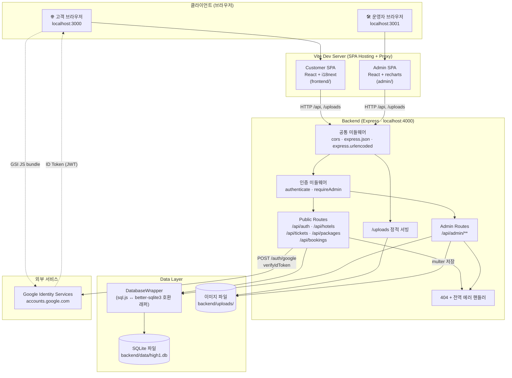
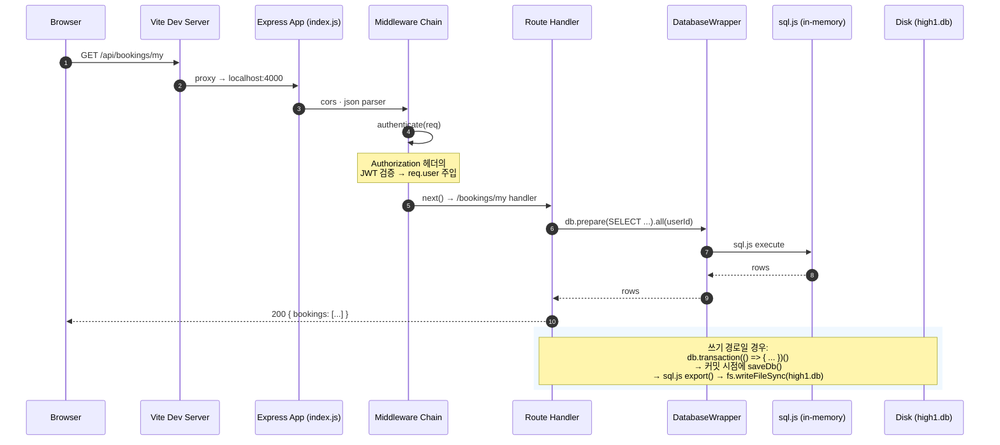
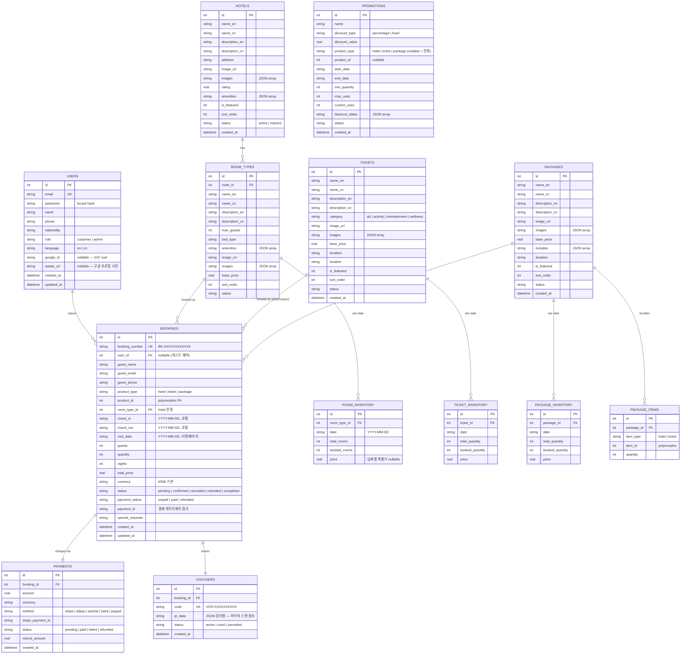

# amt-High1_Resort_HomePage

> **High1 Resort 외국인 전용 예약 플랫폼** — 3-앱 monorepo (backend API / admin panel / customer frontend)
>
> 본 문서는 시스템의 **아키텍처 · ERD · API 명세 · 기술 스택 · 코드 구조 · 보안/예외 처리 · DFD** 를 한 곳에 모은 설계 문서입니다.

---

## 목차

1. [개요](#1-개요)
2. [기술 스택](#2-기술-스택)
3. [시스템 아키텍처](#3-시스템-아키텍처)
4. [디렉터리 구조 및 모듈화](#4-디렉터리-구조-및-모듈화)
5. [ERD — 데이터 모델](#5-erd--데이터-모델)
6. [API 명세서](#6-api-명세서)
7. [데이터 흐름도 (DFD)](#7-데이터-흐름도-dfd)
8. [보안 및 예외 처리](#8-보안-및-예외-처리)
9. [실행 방법](#9-실행-방법)
10. [참고 문서](#10-참고-문서)

---

## 1. 개요

High1 Resort 외국인 전용 예약 플랫폼은 **한국 강원도 정선의 High1 리조트를 방문하는 외국 관광객**(주로 영어권 및 중화권)을 타깃으로 하는 **호텔/티켓/패키지 예약 웹 서비스**입니다. 내부적으로 세 개의 독립된 Node 앱으로 구성된 monorepo 이며, 개발 단계에서는 `start.sh` 한 줄로 세 프로세스를 동시에 기동합니다.

### 1.1 서비스 구성

| 앱 | 역할 | 접속 주소(개발) | 주 사용자 |
|---|---|---|---|
| **Backend API** | REST API · 비즈니스 로직 · SQLite 데이터 저장 · JWT 인증 · 파일 업로드 | `http://localhost:4000/api` | (내부 호출) |
| **Customer Frontend** | 고객용 예약 사이트. 호텔/티켓/패키지 검색, 예약, 바우처 조회, 프로필 관리 | `http://localhost:3000` | 외국인 고객 |
| **Admin Panel** | 운영자 콘솔. 상품/재고/예약/결제/프로모션/사용자 관리, 대시보드 통계 | `http://localhost:3001` | 리조트 운영자 |

### 1.2 핵심 도메인 개념

- **상품(Product)** 은 `hotel`, `ticket`, `package` 세 가지 타입. 예약 테이블은 `product_type` + `product_id` 의 폴리모픽 참조로 세 종류를 단일 스키마에서 처리합니다.
- **재고(Inventory)** 는 **날짜별 행(per-date row)** 으로 관리됩니다. 호텔은 `room_inventory`, 티켓은 `ticket_inventory`, 패키지는 `package_inventory` 테이블에 각각 (상품 ID × 날짜) 단위로 `total_*` 과 `booked_*` 카운터가 누적됩니다.
- **예약 생성** 시에는 가용성 확인 → `booked_*` 증가 → `bookings/payments/vouchers` INSERT 가 **하나의 SQLite 트랜잭션**으로 묶여 실행됩니다. 중간 실패 시 롤백되어 인벤토리 누수를 방지합니다.
- **바우처(Voucher)** 는 예약 1건당 1행 발급되며 QR 데이터와 UNIQUE 코드(`VCR-XXXXXXXXXX`)를 담습니다. 체크인 시 이 코드가 스캔/조회 대상입니다.
- **이중 언어(Bilingual)**: 상품 테이블의 `name_*` / `description_*` 은 `_en` / `_cn` 두 컬럼으로 병존합니다. 프런트엔드는 현재 i18n locale 에 따라 해당 컬럼을 고릅니다.
- **인증** 은 JWT(HS256, 7일 만료) 기반이며, 비밀번호 + Google Sign-In 두 가지 플로우가 하나의 `users` 테이블을 공유합니다(같은 이메일은 자동으로 연결).

### 1.3 설계 특성

- **외부 DB 서버 없음**: 데이터는 단일 SQLite 파일(`backend/data/high1.db`)로 관리되며, `sql.js` (WebAssembly) 를 통해 네이티브 바이너리 의존성 없이 순수 Node 에서 읽고 씁니다.
- **마이그레이션 시스템 없음**: 스키마 변경은 `config/database.js` 의 `CREATE TABLE` 블록과 idempotent `ALTER TABLE ... ADD COLUMN` 배열 두 곳에 함께 적어 신규/기존 환경 모두에 적용됩니다.
- **테스트 러너 없음**: 검증은 `node --check` (backend) · `vite build` (frontend/admin) · curl 기반 smoke test 에 의존합니다.
- **게스트 예약 허용**: 비로그인 상태에서도 예약 생성이 가능하며, 이후 재조회는 `booking_number` + `guest_email` 소유 증명으로 접근을 제어합니다.

---

## 2. 기술 스택

### 2.1 런타임 & 언어

| 구분 | 기술 | 용도 | 비고 |
|---|---|---|---|
| Runtime | **Node.js ≥ 18** | 모든 JS 실행 환경 | CommonJS(backend) + ESM(frontend/admin) 혼용 |
| Language | **JavaScript (ES2022)** / **JSX** | 전 영역 | TypeScript 미도입 |
| Package Manager | **npm** | 3개 앱 각자 독립 `package.json` | 루트 workspace 없음 |

### 2.2 Backend (`backend/`)

| 의존성 | 버전 | 역할 |
|---|---|---|
| `express` | ^4.21 | HTTP 서버 / 라우팅 / 미들웨어 파이프라인 |
| `sql.js` | ^1.14 | 순수 JS SQLite (WebAssembly). 네이티브 빌드 회피 |
| `bcryptjs` | ^2.4 | 비밀번호 해시 (cost 10) |
| `jsonwebtoken` | ^9.0 | JWT 발급/검증 (HS256, 7d 만료) |
| `google-auth-library` | ^10 | Google Sign-In ID token 검증 |
| `multer` | ^1.4-lts | multipart/form-data 이미지 업로드 |
| `cors` | ^2.8 | 개발환경 cross-origin 허용 |
| `uuid` | ^10 | 예약 번호 / 바우처 코드 생성 |

### 2.3 Customer Frontend (`frontend/`)

| 의존성 | 버전 | 역할 |
|---|---|---|
| `react` / `react-dom` | ^18.3 | UI 렌더러 |
| `vite` / `@vitejs/plugin-react` | ^5.4 / ^4.3 | dev 서버 + 번들러 |
| `react-router-dom` | ^6.28 | 클라이언트 라우팅 (lazy-loaded pages) |
| `i18next` / `react-i18next` | ^23 / ^15 | 국제화 (en/cn) |
| **Google Identity Services** | (CDN) | `accounts.google.com/gsi/client` 를 `index.html` 에서 직접 로드 |

### 2.4 Admin Panel (`admin/`)

| 의존성 | 버전 | 역할 |
|---|---|---|
| `react` / `react-dom` | ^18.3 | UI 렌더러 |
| `vite` / `@vitejs/plugin-react` | ^5.4 / ^4.3 | dev 서버 + 번들러 |
| `react-router-dom` | ^6.28 | 라우팅 (ProtectedRoute 로 인증 게이팅) |
| `recharts` | ^2.13 | 대시보드 시계열 차트 |

### 2.5 개발 / 배포 스크립트

| 스크립트 | 위치 | 하는 일 |
|---|---|---|
| `start.sh` | 루트 | 3개 앱 동시 기동 (+ 포트 4000/3000/3001 선점 해제, 첫 실행 시 seed) |
| `stop.sh` | 루트 | 세 포트에 바인딩된 프로세스 kill |
| `start-windows.bat` | 루트 | Windows 등가 스크립트 |
| `npm run seed` | `backend/` | 데모 데이터로 DB 전체 초기화 |
| `npm run dev` | `backend/` | `node --watch` 로 백엔드 핫 리로드 |
| `npm run dev` | `frontend/` & `admin/` | vite dev 서버 기동 |

### 2.6 도구 / 미도입 항목

- **TypeScript · ESLint · Prettier · Husky**: 현재 미설정.
- **테스트 러너 (Jest / Vitest / Playwright)**: 없음. 검증은 `node --check` + `vite build` + 수동 curl smoke test.
- **CI/CD**: 현재 구성 없음. GitHub 저장소만 존재.
- **외부 DB / Redis / 메시지 큐**: 없음. 모든 상태는 단일 SQLite 파일 + 디스크 업로드 디렉터리.

---

## 3. 시스템 아키텍처

### 3.1 레이어 구성 (Layered View)



### 3.2 요청 수명주기 (Request Lifecycle)

브라우저 요청이 서버에 도달해 응답이 돌아가는 과정:



### 3.3 런타임 프로세스 토폴로지

| 프로세스 | 포트 | 기동 명령 | 실행 주기 |
|---|---|---|---|
| `node src/index.js` (Express) | 4000 | `cd backend && npm start` | 단일 프로세스, 기동 시 `initDb()` 가 `high1.db` 를 메모리 로드 |
| `vite` (customer) | 3000 | `cd frontend && npm run dev` | 단일 프로세스, `/api` `/uploads` 를 backend 로 프록시 |
| `vite` (admin) | 3001 | `cd admin && npm run dev` | 단일 프로세스, 동일한 프록시 설정 |

> **한 가지 특수성**: sql.js 는 **메모리 내 DB** 이며 매 쓰기 후 `saveDb()` 가 전체 DB 를 `high1.db` 파일로 재직렬화합니다. 따라서 "하나의 Node 프로세스 = 한 번에 한 write-owner" 가 강제되고, 같은 DB 파일을 다른 프로세스가 동시 오픈하면 마지막 writer 가 이전 writer 의 변경을 덮어쓸 수 있습니다. 개발/단일 인스턴스 배포에 적합한 설계입니다.

---

## 4. 디렉터리 구조 및 모듈화

### 4.1 리포지터리 레이아웃

```
amt-automation/
├── README.md                 ← 이 문서 (아키텍처/ERD/API/DFD/보안)
├── CLAUDE.md                 ← AI 코딩 어시스턴트용 리포 가이드
├── GUIDE.md                  ← 한국어 end-user 실행 안내서
├── start.sh                  ← 3개 앱 한 번에 기동
├── stop.sh                   ← 3개 앱 kill
├── start-windows.bat         ← Windows 등가
│
├── backend/                  ← Express API (port 4000)
│   ├── package.json
│   └── src/
│       ├── index.js                 ← 부트스트랩 · 미들웨어 · 라우트 mount
│       ├── config/
│       │   └── database.js          ← sql.js 래퍼 + 스키마 + ALTER + transaction()
│       ├── middleware/
│       │   └── auth.js              ← authenticate · requireAdmin · JWT_SECRET
│       ├── routes/
│       │   ├── auth.js              ← /register · /login · /me · /google
│       │   ├── hotels.js            ← 호텔 조회/가용성
│       │   ├── tickets.js           ← 티켓 조회
│       │   ├── packages.js          ← 패키지 조회
│       │   ├── bookings.js          ← 예약 생성/조회/취소 (+ 인벤토리 복원 헬퍼)
│       │   └── admin/
│       │       ├── bookings.js      ← 관리자 예약 CRUD · 환불 · CSV export
│       │       ├── dashboard.js     ← /overview · 매출 시계열
│       │       ├── payments.js      ← 결제 통계 · 필터 · 상태 업데이트
│       │       ├── products.js      ← hotels/rooms/tickets/packages CRUD + /featured
│       │       ├── promotions.js    ← 프로모션 CRUD (+ blackout dates)
│       │       ├── upload.js        ← multer 기반 이미지 업로드
│       │       └── users.js         ← 사용자 목록/상세/권한 변경
│       └── seed.js                  ← 데모 데이터 시드
│
├── frontend/                 ← Customer SPA (port 3000)
│   ├── index.html                   ← Google Identity Services 스크립트 로드
│   ├── vite.config.js               ← /api, /uploads → :4000 프록시
│   └── src/
│       ├── main.jsx                 ← BrowserRouter + AuthProvider + i18n
│       ├── App.jsx                  ← 라우트 + lazy-load + Header/Footer 셸
│       ├── i18n/
│       │   ├── index.js             ← i18next 초기화
│       │   ├── en.json              ← 영어 리소스
│       │   └── cn.json              ← 중국어(간체) 리소스
│       ├── context/
│       │   └── AuthContext.jsx      ← login · register · logout · updateProfile · loginWithGoogle
│       ├── utils/
│       │   └── api.js               ← fetch 래퍼 (get/post/put/del)
│       ├── components/
│       │   ├── Header.jsx           ← 언어 토글 · 로그인 상태 · 내비
│       │   ├── Footer.jsx
│       │   ├── SearchBar.jsx        ← 홈 히어로 검색
│       │   ├── ProductCard.jsx      ← 호텔/티켓/패키지 리스트 카드
│       │   ├── DateRangePicker.jsx  ← 호텔 체크인/아웃 선택기
│       │   ├── SingleDatePicker.jsx ← 티켓/패키지 일자 선택기
│       │   └── GoogleSignInButton.jsx ← GIS 버튼 래퍼
│       └── pages/
│           ├── Home.jsx
│           ├── HotelList.jsx · HotelDetail.jsx
│           ├── TicketList.jsx · TicketDetail.jsx
│           ├── PackageList.jsx · PackageDetail.jsx
│           ├── BookingPage.jsx         ← 예약 폼 · snake_case 페이로드 · 총액 계산
│           ├── BookingConfirmation.jsx ← 예약 완료 (guest_email 쿼리 포워딩)
│           ├── BookingDetail.jsx       ← 내 예약 상세 + 취소
│           ├── MyBookings.jsx          ← 내 예약 리스트
│           ├── OrderLookup.jsx         ← 비회원 주문 조회
│           ├── Login.jsx · Register.jsx · Profile.jsx
│
├── admin/                    ← Admin SPA (port 3001)
│   ├── index.html
│   ├── vite.config.js               ← 동일한 /api, /uploads 프록시
│   └── src/
│       ├── main.jsx · App.jsx       ← ProtectedRoute 로 로그인 게이팅
│       ├── context/AuthContext.jsx  ← admin_token 으로 분리 저장
│       ├── utils/api.js             ← 401 시 자동 / 로 리다이렉트
│       ├── components/
│       │   ├── Sidebar.jsx · DataTable.jsx · Modal.jsx
│       │   ├── Pagination.jsx · StatsCard.jsx · StatusBadge.jsx
│       │   ├── ImageUploader.jsx        ← multipart/form-data 직접 호출
│       │   ├── RichTextEditor.jsx
│       │   ├── BulkInventoryManager.jsx ← 날짜 구간 일괄 재고 생성
│       │   └── PromotionManager.jsx     ← 상품 안 임베드 프로모션 CRUD
│       └── pages/
│           ├── Login.jsx
│           ├── Dashboard.jsx            ← recharts 시계열
│           ├── BookingManagement.jsx · BookingDetail.jsx
│           ├── ProductManagement.jsx
│           ├── HotelManagement.jsx      ← 호텔 + 객실 타입 + 재고
│           ├── TicketManagement.jsx · PackageManagement.jsx
│           ├── UserManagement.jsx · UserDetail.jsx
│           ├── PaymentManagement.jsx    ← 결제 리스트/필터/상세
│           └── Settings.jsx
│
├── backend/data/             ← (gitignore) SQLite 파일 런타임 저장소
│   └── high1.db
└── backend/uploads/          ← (gitignore) multer 가 저장한 이미지
```

### 4.2 모듈화 원칙

| 원칙 | 적용 방식 |
|---|---|
| **3-앱 분리** | backend/admin/frontend 는 완전히 독립된 `package.json`. 공유 코드는 현재 없음(필요 시 공용 `packages/` 도입 가능). |
| **라우트 = 파일 1개** | `backend/src/routes/<resource>.js` 하나가 해당 리소스의 전체 엔드포인트를 담당. `routes/admin/` 은 관리자 전용 네임스페이스. |
| **인증 일괄 적용** | 관리자 라우터는 각 파일 상단에서 `router.use(authenticate, requireAdmin)` 로 전체 엔드포인트에 인증을 한 번에 건다. |
| **재사용 헬퍼 export** | `routes/bookings.js` 의 `restoreBookingInventory` 는 `module.exports` 속성으로 노출되어 `admin/bookings.js` 가 동일 로직(날짜 루프 + `MAX(0, booked_* - qty)`) 을 재사용. |
| **페이지 lazy-load** | 고객 프런트의 모든 페이지 컴포넌트는 `React.lazy` + `Suspense` 로 코드 스플리팅. admin 은 일반 import (관리자 UX 우선). |
| **스타일 인라인 객체** | CSS-in-JS 라이브러리 미사용. 페이지/컴포넌트 상단의 `const styles = { ... }` 객체로 관리. |
| **i18n 키 집중** | 모든 고객 노출 문자열은 `frontend/src/i18n/{en,cn}.json` 두 파일에만 존재. 하드코딩 금지. admin 은 영어 전용이라 i18n 미적용. |
| **snake_case 계약** | backend REST 응답 · 요청은 전부 snake_case (`product_type`, `check_in`, `booking_number` …). 프런트의 camelCase 로컬 state 는 경계에서만 매핑. |

---

## 5. ERD — 데이터 모델

모든 테이블은 `backend/src/config/database.js` 의 `initTables()` 함수 안 한 블록의 `CREATE TABLE IF NOT EXISTS` 로 선언되고, 이후 컬럼 추가는 같은 함수 아래의 idempotent `ALTER TABLE ... ADD COLUMN` 배열에서 일괄 처리됩니다.

### 5.1 엔티티 관계도 (Mermaid)



### 5.2 주요 제약 / 특수 설계

| 테이블 | 설계 메모 |
|---|---|
| `users` | 이메일 UNIQUE. 소셜 로그인 사용자도 `password` NOT NULL 제약을 만족시키기 위해 **예측 불가능한 랜덤 bcrypt 해시** 를 저장합니다(아무 비밀번호로도 로그인 불가). `google_id` 의 존재가 "소셜 계정" 플래그 역할. |
| `bookings` | `user_id` 는 nullable — **게스트 예약** 지원. `product_type` + `product_id` 는 hotels/tickets/packages 세 테이블을 가리키는 폴리모픽 FK (SQLite 수준의 실제 FK 는 걸려 있지 않음). 호텔 예약은 `check_in`/`check_out`, 티켓/패키지는 `visit_date` 만 채웁니다. |
| `*_inventory` | `(상품_id, date)` UNIQUE. **매 날짜마다 1행**. `booked_*` 카운터는 예약 생성 시 증가, 취소/환불 시 `MAX(0, booked_* - qty)` 로 감소(double-decrement 방지). |
| `payments` | 1 예약 당 1 결제 행으로 관리(부분 결제 미지원). 환불은 `status='refunded'` + `refund_amount` 갱신. |
| `vouchers` | 1 예약 당 1 바우처. `code` 는 UNIQUE. 취소/환불 시 `status='cancelled'` 로 비활성화. |
| `promotions` | `blackout_dates` 는 JSON 배열 문자열. 실제 할인 적용 로직은 현재 예약 생성 경로에서 참조되지 않음(향후 확장 대상). |
| JSON-in-TEXT 컬럼 | `amenities`, `images`, `includes`, `blackout_dates` 는 SQLite TEXT 에 JSON 문자열로 저장. 라우트 핸들러가 응답 직전에 `JSON.parse` 로 펼쳐 반환. |

### 5.3 스키마 진화 규칙

- **신규 컬럼 추가**는 반드시 두 곳에 동시 적용:
  1. `initTables()` 의 `CREATE TABLE` 본문 (신규 설치 시)
  2. 같은 함수 아래 `alterStatements` 배열 (기존 DB 업그레이드 시)
- 각 `ALTER` 는 `try { db.exec(sql); } catch (e) { /* 이미 존재 */ }` 로 감싸져 **idempotent** 합니다. 서버를 여러 번 재기동해도 에러 없이 통과합니다.
- 컬럼 **삭제 / 이름 변경 / NOT NULL 제약 완화**는 SQLite 한계로 테이블 재작성 (`CREATE TABLE new → INSERT SELECT → DROP → RENAME`) 이 필요하며, 마이그레이션 시스템이 없으므로 현재는 수동으로 처리해야 합니다.

---

## 6. API 명세서

<!-- TODO:SECTION-6 -->

---

## 7. 데이터 흐름도 (DFD)

<!-- TODO:SECTION-7 -->

---

## 8. 보안 및 예외 처리

<!-- TODO:SECTION-8 -->

---

## 9. 실행 방법

<!-- TODO:SECTION-9 -->

---

## 10. 참고 문서

<!-- TODO:SECTION-10 -->
